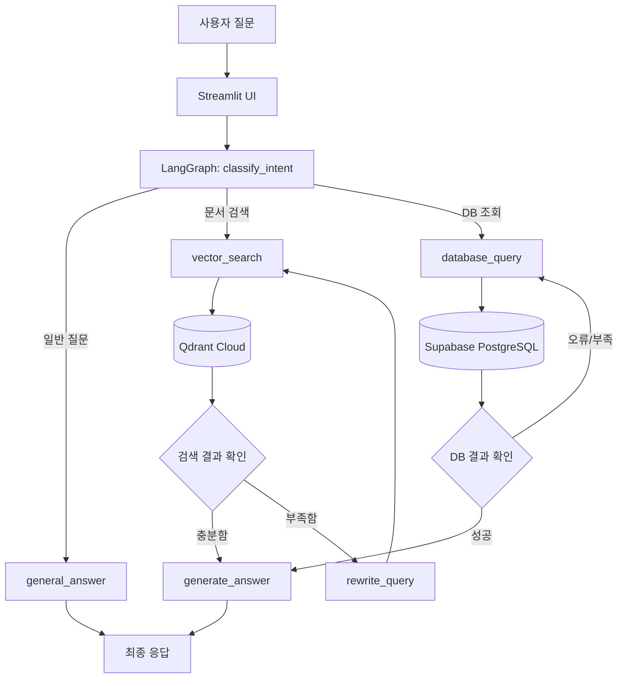

# 🎓 SMU Student AI Agent

> **RAG · Text2SQL · LangGraph 기반 상명대학교 학생 맞춤형 AI 도우미**

상명대학교 천안캠퍼스 학생들이 시간표, 학사일정, 학사규정처럼 서로 다른 형태로 흩어진 정보를 자연어 질문 한 번으로 조회할 수 있도록 만든 AI Agent 프로젝트입니다.

사용자가 질문하면 **LangGraph Agent가 질문 의도를 분류**하고, 문서형 정보는 **RAG + Qdrant**, 정형 데이터는 **Text2SQL + Supabase(PostgreSQL)** 로 조회한 뒤 LLM이 최종 답변을 생성합니다.

---

## 📌 Project Overview

학교 정보는 PDF, 표, CSV, 공지 문서 등 여러 형태로 분산되어 있습니다. 학생 입장에서는 단순한 질문 하나를 해결하기 위해 여러 문서를 직접 찾아보고 조건을 비교해야 하는 경우가 많습니다.

이 프로젝트의 목표는 이러한 문제를 해결하는 **학생용 통합 AI Agent**를 구현하는 것입니다.

### 해결하고자 한 문제

- 학과·학년·학점·교수·요일 조건을 조합한 시간표 검색이 번거로움
- 수강신청, 등록, 개강 등 학사일정을 PDF에서 직접 찾아야 함
- 휴학·복학·전과·다전공·졸업·장학 등 학사규정이 긴 문서 안에 흩어져 있음
- PDF 검색과 DB 검색이 별도로 존재해 복합질문 대응이 어려움

### 핵심 아이디어

질문의 성격에 따라 적절한 검색 방식을 자동 선택합니다.

- **문서형·설명형 질문** → RAG
- **정확한 조건·집계가 필요한 질문** → Text2SQL
- **일반 대화** → LLM 직접 응답
- 검색 결과가 부족하면 **쿼리 재작성 또는 재시도**

---

## ✨ Main Features

- 📚 학과·학년별 개설과목 조회
- 👨‍🏫 담당교수별 수업 검색
- 🕐 요일·강의시간·강의실 검색
- 🔢 학점 및 조건 조합 검색
- 📅 수강신청·등록·개강 등 학사일정 조회
- 📝 휴학·복학·군휴학·전과 관련 규정 검색
- 🎓 다전공·부전공·졸업요건 등 학사정보 검색
- 💰 장학 및 학자금 관련 문서 검색 확장 가능
- 🔍 PDF 기반 Semantic Search
- 🗄️ 자연어 → SQL 자동 생성 및 PostgreSQL 조회
- 🤖 LangGraph 기반 의도 분류 및 검색 경로 제어
- 🔁 검색 실패 시 재작성·재시도 흐름
- 💬 Streamlit 기반 대화형 Demo UI

---

## 🏗️ System Architecture



실제 LangGraph는 `classify_intent → general_answer / vector_search / database_query` 조건부 라우팅 구조를 사용하며, 벡터 검색 실패 시 `rewrite_query`, DB 조회 실패 시 재시도를 거치도록 구성했습니다.

---

## 🧠 LangGraph Agent Flow

프로젝트의 핵심은 단순히 RAG와 SQL을 각각 호출하는 것이 아니라, **질문을 먼저 해석하고 적절한 도구로 라우팅하는 Agent 구조**입니다.

```text
사용자 질문
   │
   ▼
classify_intent
   │
   ├── general_answer ────────────────> END
   │
   ├── vector_search
   │      │
   │      ├── 결과 충분 → generate_answer → END
   │      └── 결과 부족 → rewrite_query → vector_search
   │
   └── database_query
          │
          ├── 조회 성공 → generate_answer → END
          └── 조회 오류 → database_query 재시도
```

주요 구현 파일:

- `src/ai/graph.py` — LangGraph 전체 그래프 및 조건부 라우팅
- `src/ai/state.py` — Agent State 정의
- `src/ai/nodes.py` — 의도 분류, 검색, 답변 생성 노드
- `src/ai/retriever.py` — Qdrant 벡터 검색
- `src/ai/text2sql.py` — 자연어 → SQL 생성 및 실행
- `src/demo/streamlit_example.py` — Streamlit Demo UI

---

## 🔍 RAG Pipeline

설명형 질문이나 긴 문서 안에서 의미 기반 검색이 필요한 경우 RAG를 사용합니다.

```text
PDF 문서
   ↓
텍스트 추출
   ↓
Chunk / Document 구성
   ↓
OpenAI Embedding
   ↓
Qdrant Cloud 저장
   ↓
사용자 질문 Embedding
   ↓
Similarity Search
   ↓
관련 문서 검색
   ↓
LLM 최종 답변
```

### Vector Database

Qdrant Cloud를 사용하며 현재 Retriever에서는 다음 Collection을 사용합니다.

| Collection | 역할 |
|---|---|
| `SMU_2026_2` | 학사 관련 문서 벡터 검색 |
| `SMU_2026_2_time` | 시간표 관련 보조 벡터 검색 |

Embedding 모델은 `text-embedding-3-large`를 사용합니다.

정확한 학과, 학점, 교수, 강의시간 조건 검색은 벡터 검색보다 **Supabase Text2SQL을 우선**하도록 설계했습니다.

---

## 🗄️ Text2SQL Pipeline

정확한 조건 조회가 필요한 질문은 자연어를 PostgreSQL SELECT 쿼리로 변환하여 Supabase에서 직접 조회합니다.

```text
자연어 질문
   ↓
LLM이 DB Schema 분석
   ↓
PostgreSQL SELECT 생성
   ↓
SQL 안전성 검사
   ↓
Supabase 실행
   ↓
조회 결과
   ↓
LLM 자연어 답변
```

### 주요 Supabase 데이터

#### 1. `SMU_2026_2`
2026학년도 2학기 개설강좌 및 시간표 데이터

주요 컬럼:

- `소속정보`
- `개설학과`
- `학년`
- `이수구분`
- `학수번호`
- `교과목명`
- `학점`
- `강의시간(강의실)`
- `분반`
- `담당교수`

#### 2. `SMU_2026_2_academic_schedule`
학사일정 조회용 데이터

주요 컬럼:

- `학년도학기`
- `일정`
- `시작일_원문`
- `종료일_원문`
- `내용`
- `비고`

#### 3. `SMU_2026_2_academic_guide`
학사규정 및 학사안내 검색용 데이터

주요 컬럼:

- `대분류`
- `소분류`
- `내용`
- `원문페이지`

이를 통해 단순 시간표 검색뿐 아니라 일정·규정까지 SQL 기반으로 확장했습니다.

---

## 🧩 Example Queries

### 시간표 / 개설강좌

```text
AI모빌리티공학과 2학년 과목 알려줘
```

```text
AI모빌리티공학과 목요일 수업 알려줘
```

```text
강태구 교수님 수업 알려줘
```

```text
3학점 과목 10개 알려줘
```

### 학사일정

```text
수강신청 정정기간은 언제야?
```

```text
2학기 등록기간 알려줘
```

```text
개강일은 언제야?
```

### 학사규정

```text
군휴학 신청할 때 필요한 서류 알려줘
```

```text
다전공 신청 자격 알려줘
```

```text
졸업요건 알려줘
```

### 복합질문

```text
AI모빌리티공학과 2학년 목요일 수업과 수강신청 정정기간을 같이 알려줘
```

이처럼 한 문장 안에 **시간표 + 학사일정**이 함께 포함된 질문도 처리할 수 있도록 Text2SQL 프롬프트를 확장했습니다.

---

## 🛠️ Troubleshooting & Improvements

### 1. PDF → CSV 변환 과정에서 학과 정보 누락

**문제**

원본 시간표 PDF에서는 학과명이 표 내부 컬럼이 아니라 각 페이지/영역의 제목 형태로 존재했습니다. 일반적인 PDF → CSV 변환을 수행하자 `학년`, `교과목명`, `담당교수`, `강의시간` 등은 추출됐지만 **학과명이 누락**되었습니다.

그 결과 다음과 같은 질문을 정확히 처리할 수 없었습니다.

```text
AI모빌리티공학과 2학년 과목 알려줘
```

**해결**

PDF의 페이지 제목과 각 과목 행을 연결하여 CSV에 다음 컬럼을 새로 추가했습니다.

```text
소속정보
개설학과
```

이후 Supabase 테이블을 수정하고 데이터를 다시 적재했습니다.

Text2SQL 프롬프트에도 다음 원칙을 추가했습니다.

> 특정 학과의 개설과목을 검색할 때 교과목명으로 추정하지 않고 반드시 `개설학과` 컬럼을 사용한다.

**결과**

학과 + 학년 + 요일 + 학점 등의 복합조건 검색이 가능해졌습니다.

---

### 2. 실제 DB 테이블명과 Prompt의 테이블명이 불일치

**문제**

초기 Text2SQL Prompt에서는 시간표 테이블을 `course_schedule`로 설명했지만 실제 Supabase 테이블명은 `SMU_2026_2`였습니다.

**해결**

- Prompt를 실제 DB Schema 중심으로 재구성
- `SQLDatabase.get_table_info()`로 실제 Schema 전달
- 대문자가 포함된 PostgreSQL 테이블에 큰따옴표 적용
- 존재하지 않는 테이블 및 컬럼 생성을 금지

```sql
FROM "SMU_2026_2"
```

---

### 3. 단순 시간표 DB에서 학사정보 통합 DB로 확장

**문제**

시간표만 가지고는 다음과 같은 질문을 해결할 수 없었습니다.

```text
수강신청 정정기간 언제야?
군휴학 신청 서류가 뭐야?
다전공 신청 자격이 어떻게 돼?
```

**해결**

학사안내 PDF를 분석하여 용도별 CSV로 분리하고 Supabase에 추가했습니다.

```text
SMU_2026_2
→ 개설강좌 / 학과 / 교수 / 시간표

SMU_2026_2_academic_schedule
→ 날짜 / 학사일정

SMU_2026_2_academic_guide
→ 규정 / 방법 / 자격 / 절차 / 서류
```

Text2SQL Prompt가 질문 유형에 따라 적절한 테이블을 선택하도록 확장했습니다.

---

### 4. RAG 검색 결과가 부족한 경우 재검색

벡터 검색 결과가 충분하지 않을 경우 바로 잘못된 답을 생성하지 않고 `rewrite_query` 노드에서 검색어를 재작성한 뒤 다시 Qdrant를 검색하도록 LangGraph 흐름을 구성했습니다.

---

### 5. Text2SQL 안전성 강화

LLM이 생성한 SQL을 그대로 실행하는 위험을 줄이기 위해 실행 가능한 쿼리를 SELECT 계열로 제한했습니다.

금지 대상 예시:

```text
INSERT
UPDATE
DELETE
DROP
ALTER
TRUNCATE
CREATE
```

---

## 💻 Tech Stack

| Category | Technology |
|---|---|
| Language | Python 3.11+ |
| LLM Framework | LangChain |
| Agent Orchestration | LangGraph |
| LLM | OpenAI Chat Model |
| Embedding | OpenAI `text-embedding-3-large` |
| Vector DB | Qdrant Cloud |
| Relational DB | Supabase PostgreSQL |
| SQL Layer | SQLAlchemy / LangChain SQLDatabase |
| Validation | Pydantic |
| PDF Processing | PyMuPDF |
| Web UI | Streamlit |
| Data Processing | Pandas |

---

## 📁 Project Structure

```text
smu-student-rag-agent/
│
├── documents/                 # 프로젝트 문서 및 데이터 자료
├── examples/                  # 실습/예제
│
├── src/
│   ├── ai/
│   │   ├── __init__.py
│   │   ├── graph.py           # LangGraph Workflow
│   │   ├── nodes.py           # Agent Nodes
│   │   ├── retriever.py       # Qdrant Retriever
│   │   ├── state.py           # Agent State
│   │   └── text2sql.py        # Text2SQL Engine
│   │
│   └── demo/
│       └── streamlit_example.py
│
├── langgraph.json             # LangGraph 실행 설정
├── pyproject.toml             # Python dependencies
└── README.md
```

---

## 🚀 Getting Started

### 1. Repository Clone

```bash
git clone https://github.com/MISEONG0216/smu-student-rag-agent.git
cd smu-student-rag-agent
```

### 2. Python Environment

Python `3.11 ~ 3.13` 환경을 권장합니다.

```bash
python -m venv .venv
```

Windows:

```bash
.venv\Scripts\activate
```

macOS / Linux:

```bash
source .venv/bin/activate
```

### 3. Install

```bash
pip install -e .
```

### 4. Environment Variables

프로젝트 루트에 `.env` 파일을 생성합니다.

```env
OPENAI_API_KEY=your_openai_api_key
QDRANT_URL=your_qdrant_url
QDRANT_API_KEY=your_qdrant_api_key
SUPABASE_DB_URL=your_supabase_postgresql_url
```

> ⚠️ API Key와 DB 비밀번호는 절대 GitHub에 Commit하지 않습니다.

### 5. Streamlit Demo

```bash
streamlit run src/demo/streamlit_example.py
```

기본적으로 브라우저에서 Streamlit Demo 화면을 사용할 수 있습니다.

### 6. LangGraph

LangGraph 개발 서버를 사용하는 경우:

```bash
langgraph dev
```

---

## 🔐 Security

이 프로젝트는 외부 API와 DB를 사용하므로 인증정보 관리가 중요합니다.

- `.env` 파일은 Git에 Commit하지 않기
- OpenAI API Key 공개 금지
- Qdrant API Key 공개 금지
- Supabase DB URL 및 Password 공개 금지
- 실제 운영 시 DB 계정에 최소 권한 적용 권장
- Text2SQL은 SELECT 전용으로 제한

---

## 📈 What I Learned

이 프로젝트를 통해 단순 LLM 호출을 넘어 실제 AI 서비스가 어떻게 구성되는지 경험했습니다.

- 문서 검색에 적합한 **RAG 구조 설계**
- Qdrant Vector Database와 Embedding 활용
- 자연어를 구조화된 SQL로 변환하는 **Text2SQL 설계**
- PDF 데이터를 DB 검색에 적합한 형태로 전처리하는 과정
- LangGraph를 이용한 **Agent State / Node / Conditional Routing 설계**
- 검색 결과 부족 및 SQL 오류에 대한 재시도 흐름 구현
- 비정형 문서와 정형 DB를 하나의 사용자 경험으로 통합
- Streamlit을 이용한 실제 Demo Web App 구현
- 데이터 품질이 LLM 검색 정확도에 직접적인 영향을 준다는 점

---

## 🎯 Portfolio Highlights

이 프로젝트에서 특히 강조할 수 있는 부분은 다음과 같습니다.

### 1. 단순 챗봇이 아닌 Agent 구조

질문을 바로 LLM에 전달하지 않고 **질문 의도를 분석한 뒤 General / RAG / Database 중 적절한 경로를 선택**합니다.

### 2. RAG + Text2SQL Hybrid Architecture

문서형 질문과 정형 조건 검색은 본질적으로 검색 방식이 다르다는 점을 반영하여 두 방식을 함께 사용했습니다.

### 3. 실제 데이터 문제 해결

PDF → CSV 변환 과정에서 누락된 학과 정보를 발견하고 데이터 구조 자체를 수정하여 검색 정확도를 개선했습니다.

### 4. 서비스 범위 확장

초기 시간표 검색에서 시작해 학사일정 및 학사규정까지 DB 구조를 확장하여 복합질문에 대응할 수 있도록 개선했습니다.

### 5. End-to-End 구현

```text
데이터 수집
→ PDF/CSV 전처리
→ Vector DB / PostgreSQL 적재
→ Retriever / Text2SQL
→ LangGraph Agent
→ Streamlit Demo
```

전체 흐름을 직접 구현했습니다.

---

## 🔮 Future Work

- [ ] 시간표와 학사규정을 동시에 조회하는 복합질문을 SQL 하나가 아니라 Multi-Step Agent로 분해
- [ ] 사용자 학과·학년 정보를 반영한 개인화 검색
- [ ] 수강 가능 과목 자동 추천
- [ ] 시간 충돌을 고려한 자동 시간표 생성
- [ ] 학사일정 D-Day 및 알림 기능
- [ ] PDF/공지 업데이트 자동 수집 및 Vector DB 동기화
- [ ] 출처 페이지와 근거를 UI에서 더욱 명확하게 표시
- [ ] 평가 데이터셋을 구축하여 RAG / Text2SQL 정확도 정량 평가
- [ ] Streamlit Demo 스크린샷 및 시연 영상 추가

---

## 📚 Data Scope

본 프로젝트는 상명대학교 학생 대상 AI 서비스 개발 실습을 목적으로 구축되었습니다.

사용 데이터는 학사일정, 개설강좌, 시간표, 학사안내 등 프로젝트 수행 과정에서 확보한 자료를 기반으로 하며, 실제 학교 정책은 변경될 수 있습니다.

> 본 프로젝트의 답변은 공식 행정 안내를 대체하지 않습니다. 실제 신청·등록·졸업 등 중요한 학사 업무는 반드시 상명대학교 공식 공지를 다시 확인해야 합니다.

---

## 👨‍💻 Repository

**GitHub**  
https://github.com/MISEONG0216/smu-student-rag-agent

---

## 📄 License

현재 별도의 License를 지정하지 않았습니다. 소스 사용이 필요한 경우 Repository 소유자에게 문의해주세요.
